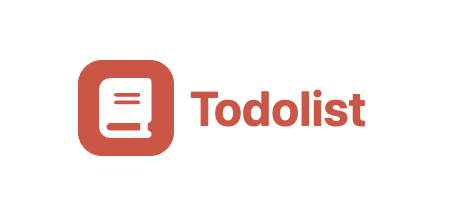

# ToDoList-JOCO
<p>
    <a href="https://www.typescriptlang.org/" target="blank_"></a>
    <a href="https://tailwindcss.com/" target="blank_"></a>
    <a href="https://reactjs.org/" target="blank_"></a>
</p>
<p align="center">

</p>
# Overview
## Installation
```bash
$ yarn install
```
## Running the app

```bash
# development
$ yarn run start

# watch mode
$ yarn run start:dev

# production mode
$ yarn run start:prod
```

## Test

```bash
# unit tests
$ yarn run test

# e2e tests
$ yarn run test:e2e

# test coverage
$ yarn run test:cov
```


