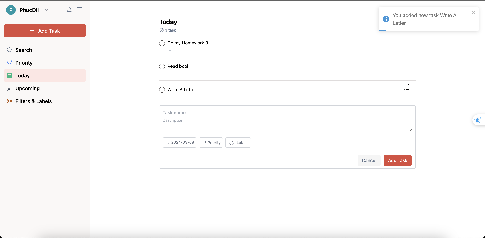
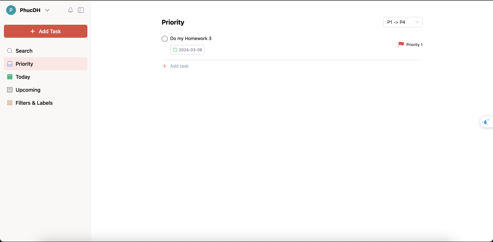
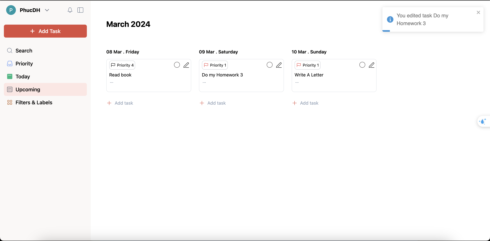
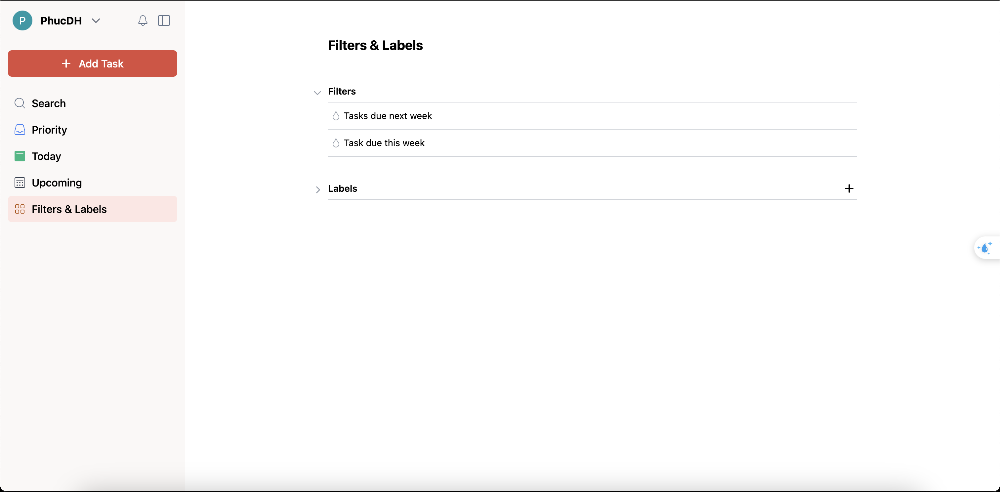

# ToDoList-JOCO
<p>
    <a href="https://www.typescriptlang.org/" target="blank_"></a>
    <a href="https://tailwindcss.com/" target="blank_"></a>
    <a href="https://reactjs.org/" target="blank_"></a>
</p>
<p align="center">

</p>

# Overview
A Web App is a product created for learning purposes. It allows users to take notes and manage their tasks on a daily basis.
- Today screen

    - Create new task (Task_name, Description,Due Time, Priority, Label)
    - Edit task
    - Check Task
    - Delete Task
- Priority Screen

    - Sort tasks by priority.
- Upcoming Screen

    - List of tasks by week.
    - Drag and drop to change the due time.
- Filter&Label screen

    - List of Filters
    - List of Label (create new label, Edit label, Delete)
    - View all tasks that contain a specific label.

## Demo Video
Please visit this link to see the [demo video](https://drive.google.com/file/d/11RCnfczRA4IbGqzno4q2ckN9A8Z8ivRv/view?usp=sharing).

## Installation
```bash
$ yarn install
```
## Running the app

```bash
# development
$ yarn run start

# watch mode
$ yarn run start:dev

# production mode
$ yarn run start:prod
```

## Test

```bash
# unit tests
$ yarn run test

# e2e tests
$ yarn run test:e2e

# test coverage
$ yarn run test:cov
```


